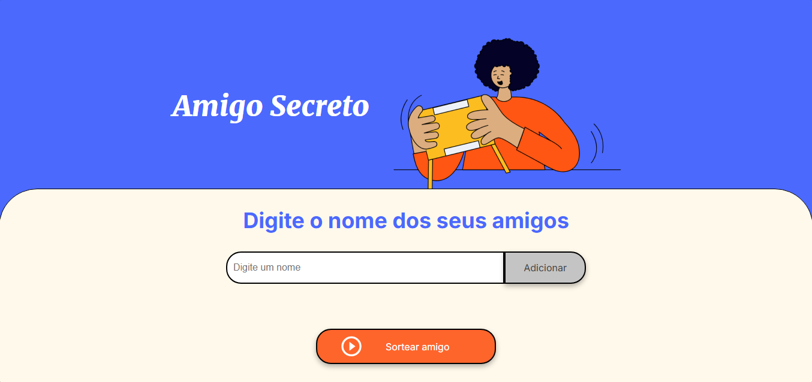

<h1 align="center"> Challenge Amigo Secreto </h1>

  <a href="#-tecnologias">Tecnologias</a>&nbsp;&nbsp;&nbsp;|&nbsp;&nbsp;&nbsp;
  <a href="#-projeto">Projeto</a>&nbsp;&nbsp;&nbsp;|&nbsp;&nbsp;&nbsp;
  <a href="#-licença">Licença</a>

  

 

  

## 🚀 Tecnologias

Esse projeto foi desenvolvido com as seguintes tecnologias:

- HTML e CSS
- JavaScript
- Git e Github

## 💻 Projeto

Este projeto foi desenvolvido como parte do desafio do programa ONE da Alura e Oracle. O objetivo do desafio é criar uma aplicação simples para realizar sorteios de Amigo Secreto entre um grupo de amigos.

## 📝 Licença

Esse projeto está sob a licença MIT.
